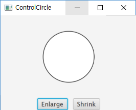

# CircleFX Lab1
  - JoyJava Lecture Note by idebtor@gmail.com
  ------------------

This Lab draws a circle in at the center of a window with two buttons. One button enlarges the circle, the other shrinks it as a user clicks the button.  The circle is placed in its own pane, called CirclePane class, which is a subclass of StackPane. The CirclePane object is added to the center of a BorderPane which is added to the scene of the window. Two buttons are placed at the bottom of this BorderPane.

Note that CircleFX has a CirclePane object as an instance variable.



Figure 1. Circle with two control buttons


```java
import javafx.application.Application;
import javafx.geometry.Pos;
import javafx.scene.Scene;
import javafx.scene.control.Button;
import javafx.scene.layout.StackPane;
import javafx.scene.layout.HBox;
import javafx.scene.layout.BorderPane;
import javafx.scene.paint.Color;
import javafx.scene.shape.Circle;
import javafx.stage.Stage;

public class CircleFX extends Application {
  private CirclePane circlePane = new CirclePane();

  @Override // Override the start method in the Application class
  public void start(Stage primaryStage) {
    // Hold two buttons in an HBox
    HBox hBox = new HBox();
    hBox.setSpacing(10);
    hBox.setAlignment(Pos.CENTER);
    Button btEnlarge = new Button("Enlarge");
    Button btShrink = new Button("Shrink");
    hBox.getChildren().add(btEnlarge);
    hBox.getChildren().add(btShrink);

    // Create a BorderPane object, borderPane
    // Place circlePane at the center of borderPane object
    BorderPane borderPane = new BorderPane();


    // Place hBox at the bottom of borderPane object
    // Set alignment such that hBox is located at the center.


    // Create a scene and place it in the stage
    Scene scene = new Scene(borderPane, 300, 200);
    primaryStage.setTitle("ControlCircle"); // Set the stage title
    primaryStage.setScene(scene); // Place the scene in the stage
    primaryStage.show(); // Display the stage
  }

  /**
   * The main method is only needed for the IDE with limited
   * JavaFX support. Not needed for running from the command line.
   */
  public static void main(String[] args) {
    launch(args);
  }
}

/**
 * Define a class called EnlargeHandler that implements the
 * interface EventHandler<ActionEvent>.
 * Then this class must override handle(ActionEvent e).
 */

class CirclePane extends StackPane {
  private Circle circle = new Circle(50);

  public CirclePane() {
    getChildren().add(circle);
    circle.setStroke(Color.BLACK);
    circle.setFill(Color.WHITE);
  }

  public void enlarge() {
    circle.setRadius(circle.getRadius() + 2);
  }

  public void shrink() {
    circle.setRadius(circle.getRadius() > 2 ?
      circle.getRadius() - 2 : circle.getRadius());
  }
}
```
