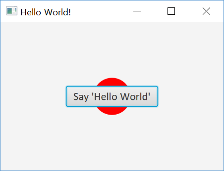

# JavaFX Hello World Labs

JavaFX is a set of graphics and media packages that enable developers to design, create, test, debug, and deploy rich client applications that operate consistently across diverse platforms.

The JavaFX SDK and Runtime are included in the JDK, starting with Java SE 7 Update 2. Surely, as of today, JDK-8u191 JavaFX is included with the standard JDK and JRE bundles if you have an older Java Installation, you may update it [here]().  __Do not use Java SE 11.0.1(LTS)__.    

## JavaFX in Java 8
In Java 8, the JavaFX is not a part of the JavaSE execution environment, but as an external library – `lib\ext\jfxrt.jar`

## JavaFX and Eclipse

By default, when we access the JavaFX APIs, Eclipse will prompts the Access restriction errors. To solve this, you must install e(fx)clipse plugin separately.  

- Start Eclipse and a java project
- Go to the help menu and select "Install New Software..."
- Select the latest eclipse.org release at "Work with" pull-down menu
- Find e(fx)clipse item in the list (Sometimes it is hard to find.)
    - If they are listed by groups, go "General Purpose Tools" first.
    - If you cannot find it, uncheck "Group items by category" see them all.
- Follow the instructions.
- On completion, you will be asked to restart the Eclipse.

## Java Hello World Example

A simple example where we use a `StackPane` to lay out one `Circle` that draw the background and a `Button` with a `Hello World` text.

__Hint:__ Add a circle and a button in a `StackPane`. Add the `Stackpane` object to a `scene` and the `scene` to the `primaryStage`.

__Sample Output:__



```java
import javafx.application.Application;
import javafx.scene.Scene;
import javafx.scene.control.Button;
import javafx.scene.layout.StackPane;
import javafx.scene.paint.Color;
import javafx.scene.shape.Circle;
import javafx.scene.text.Font;
import javafx.stage.Stage;

public class HelloFX extends Application{

	public static void main(String[] args) {
		launch();
	}

	@Override
	public void start(Stage primaryStage) throws Exception {

		primaryStage.setTitle("Hello World!");

		// add two circles and two rectangles in a GridPane, color filled
		// place the button at the center in a BorderPane
		// count the button clicks
		// display the button clicks at the bottom in the BorderPane

		Circle c1 = new Circle();
		c1.setFill(Color.rgb(255, 0, 0));
		c1.setRadius(25);

		Button btn= new Button();
		btn.setFont(new Font("Calibri", 15));
		btn.setText("Say 'Hello World'");

		StackPane root = new StackPane();
		root.getChildren().add(c1);
		root.getChildren().add(btn);
		primaryStage.setScene(new Scene(root, 300, 200));
		primaryStage.show();
	}
}
```
-------------------
Based this code shown above, now, we would like to add something more to this code. Let us move on next Lab.
