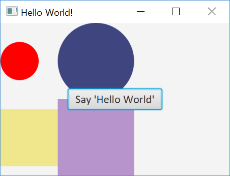

# JavaFX Hello World Lab 1

You already have a working version of HellFX code from the previous lesson. Now you copy it and rename it as HelloFX1.

Now we want to do the followings;
- Add two circles and two rectangles in a GridPane, those shapes filled with your favorite color
    - Create Circle c1 with its radius = 25
    - Create Rectangle r1 with width, height = 75
    - Create Circle c2 with its radius = 50
    - Create Rectangle r2 with width, height = 100
- Place the button at the `Center` in a `BorderPane`. The button has a text with `Say Hello World`.

The one sample output:



## Java Hello World Example

A simple example where we use a `StackPane` to lay out one `Circle` that draw the background and a `Button` with a `Hello World` text.

__Hint:__ Add a circle and a button in a `StackPane`. Add the `Stackpane` object to a `scene` and the `scene` to the `primaryStage`.

```java
import javafx.application.Application;
import javafx.scene.Scene;
import javafx.scene.control.Button;
import javafx.scene.layout.StackPane;
import javafx.scene.paint.Color;
import javafx.scene.shape.Circle;
import javafx.scene.text.Font;
import javafx.stage.Stage;

public class HelloFX extends Application{

	public static void main(String[] args) {
		launch();
	}

	@Override
	public void start(Stage primaryStage) throws Exception {

		primaryStage.setTitle("Hello World!");

		// add two circles and two rectangles in a GridPane, color filled
		// place the button at the center in a BorderPane
		// count the button clicks
		// display the button clicks at the bottom in the BorderPane

		Circle c1 = new Circle();
		c1.setFill(Color.rgb(255, 0, 0));
		c1.setRadius(25);

		Button btn= new Button();
		btn.setFont(new Font("Calibri", 15));
		btn.setText("Say 'Hello World'");

		StackPane root = new StackPane();
		root.getChildren().add(c1);
		root.getChildren().add(btn);
		primaryStage.setScene(new Scene(root, 300, 200));
		primaryStage.show();
	}
}
```
-------------------
Based this code shown above, now, we would like to add something more to this code. Let us move on next Lab.
