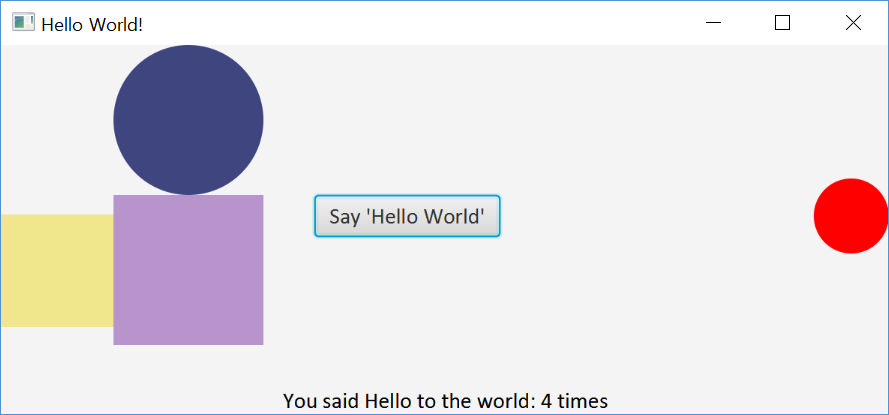
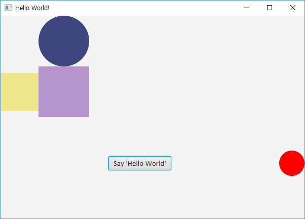

# JavaFX Hello World Lab2
  - JoyJava Lecture Note by idebtor@gmail.com
  ------------------

You already have a working version of `HellFX1.java` code from the previous lesson. Now you copy it and rename it as `HelloFX2.java`.  In this lab, we do
    > Count the button clicks.
    > Display the count of the button clicks at the bottom in the `BorderPane`

We may articulate the tasks for this lab as shown below in detail:
- To count the button clicks, declare an instance variable, not a local variable.
- Place the 'Hello World' button at the `Center` in a `BorderPane` instead of `GridPane` or a `StackPane`.
- Create a new label and place it at a bottom in the `BorderPane`.  This label display the message which has the number of the button clicks.
    - Set the text based on the number of the button clicks.
    - This should be on the button's setOnAction event handler.
    - Firstly, use an anonymuse inner class.
    - Secondly, use a lambda expression.
- Move the `Circle c1` to the center of right side of `BorderPane`.
- On completion,
    - the button click count message will be displayed at the bottom of the windows.
    - the `button`, its `count` and `circle` will move along when the window resizes since they are placed in `BorderPane`.

The one sample output:



__Hint:__ Add a circle and a button in a `StackPane`. Add the `Stackpane` object to a `scene` and the `scene` to the `primaryStage`.

```java
import javafx.application.Application;
import javafx.scene.Scene;
import javafx.scene.control.Button;
import javafx.scene.layout.StackPane;
import javafx.scene.paint.Color;
import javafx.scene.shape.Circle;
import javafx.scene.text.Font;
import javafx.stage.Stage;

public class HelloFX extends Application{

	public static void main(String[] args) {
		launch();
	}

	@Override
	public void start(Stage primaryStage) throws Exception {

		primaryStage.setTitle("Hello World!");

		// add two circles and two rectangles in a GridPane, color filled
		// place the button at the center in a BorderPane
		// count the button clicks
		// display the button clicks at the bottom in the BorderPane

		Circle c1 = new Circle();
		c1.setFill(Color.rgb(255, 0, 0));
		c1.setRadius(25);

		Button btn= new Button();
		btn.setFont(new Font("Calibri", 15));
		btn.setText("Say 'Hello World'");

		StackPane root = new StackPane();
		root.getChildren().add(c1);
		root.getChildren().add(btn);
		primaryStage.setScene(new Scene(root, 300, 200));
		primaryStage.show();
	}
}
```
-------------------

JoyQuestion:
You may see a warning when write the third line in code snippet shown below. Why the warning and how do you get rid of the warning?
```java
BorderPane bp = new BorderPane();   
bp.setBottom(lbl);
bp.setAlignment(lbl, Pos.CENTER);
```

JoyChallenge:
  > Do Lab2 without using a `StackPane`.
  > You may increase the size of the scene. Why is the label shown off the scene at the beginning?

JoyLesson:
- The `GridPane` takes the entire space of one section(e.g. Top) of the `BorderPane`. Therefore, `setAlignment` is meaningless for `GridPane`.


